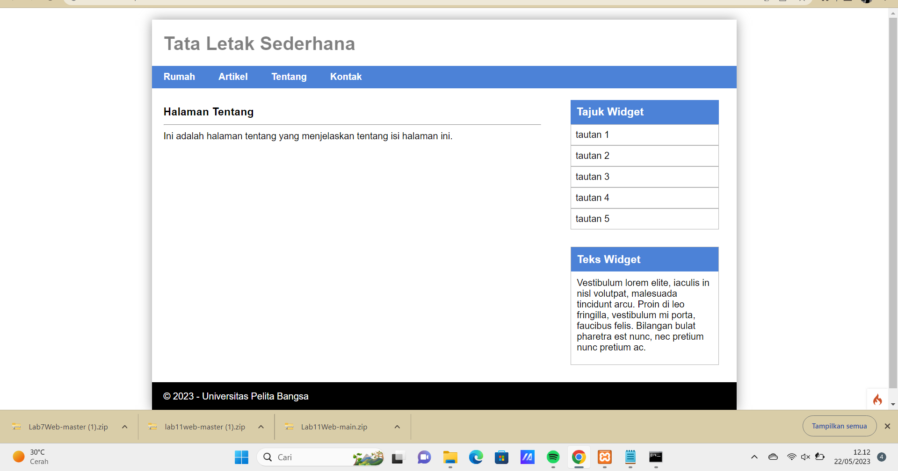
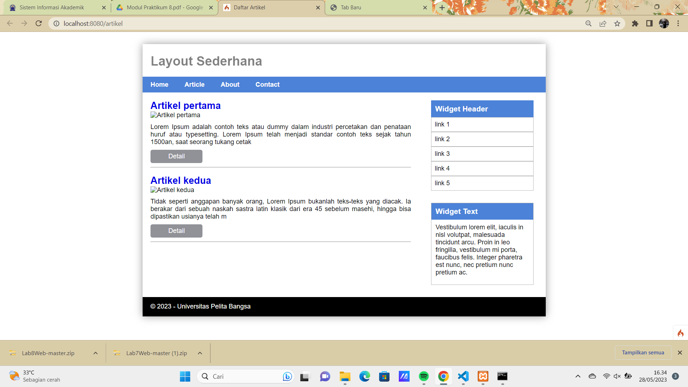
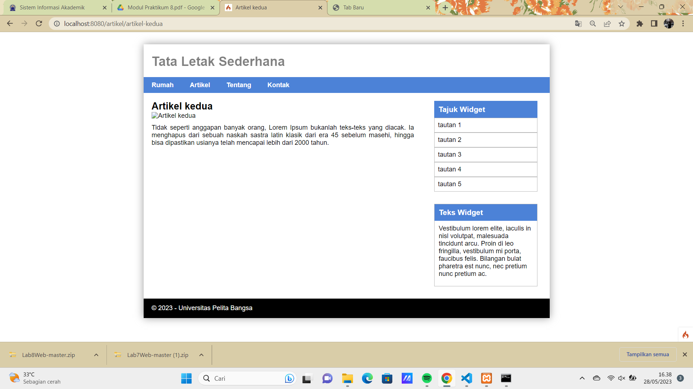
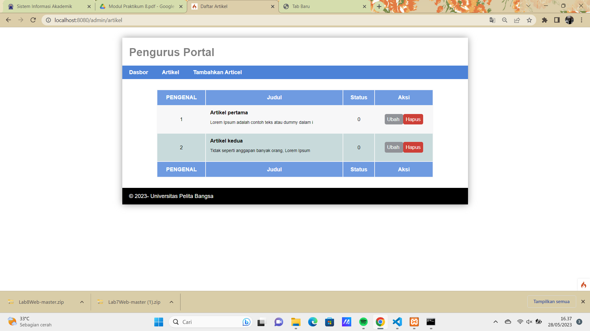
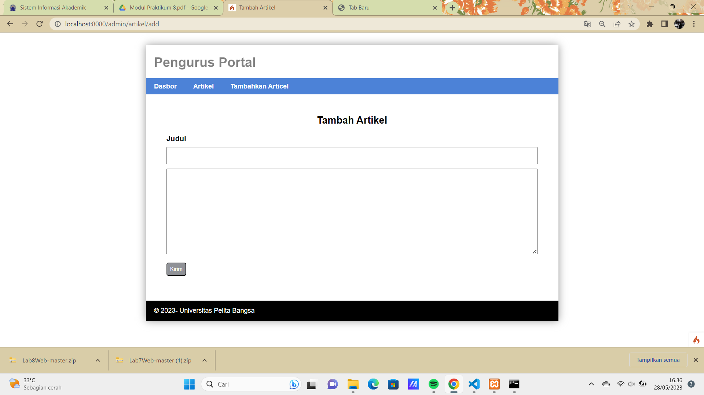
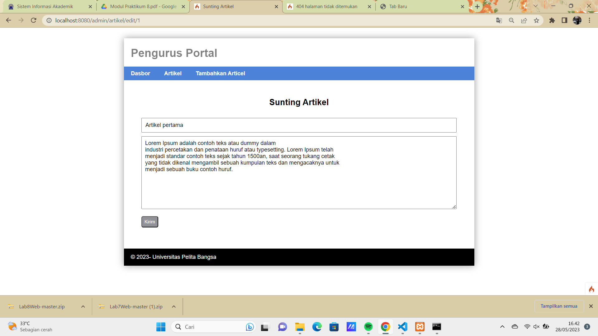

# Praktikum 8: Framework Lanjutan (CRUD)

```bash
Nama    : Savariana Rika Anugrahaini
Kelas   : TI.21.A.3
Nim     : 312110052
```

## output

```bash
Output CRUD pada Praktikum 8 - Codeigniter seperti berikut ini:
```

### Menu User

1. Tentang



2. Artikel



3. Detail 



### Menu Admin

1. Artikel-Admin



2. Tambah Artikel



3. Ubah Artikel


4. Hapus Artikel




Nice To Meet You(●'◡'●)